# Transfer and Output Curve Analysis Toolkit (TOCAT)

This toolkit is used for the differential analysis of transfer and output characteristics contained in the dissertation by Jesus O. Guardado.  Core functionality is built around comparing parameters extracted from one curve with parameters extracted from another curve.  Thus, in addition to outputting many of the "raw" values, they are also output as deltas/changes and percent changes.  The toolkit also provides several other functions relevant to the analysis of transistor performance.

## Usage

This toolkit can run the analysis over a single or multiple nested files, for example:

**Single**

In this case, all the files contained within the same folder. The script will automatically go through all the files and then create the folders with the outputs.  Example:

```
.
├── Data
│   ├── waf2 4B2 2mm L20W2A TC.csv
│   ├── waf2 4B2 2mm L20W2A TC-s.csv
│   ├── waf2 4B2 2mm L20W2A +-1.5V TC.csv
│   ├── waf2 4B2 2mm L20W2A +-1.5V TC-s.csv
│   ├── waf2 4B2 2mm L20W2A +-1.5V OC.csv
│   ├── waf1 4C4 2mm L200W2B F4TCNQ_0.05 TC.csv
```

**Multi**

In the second case, we have nested folder, (e.g. experiments from different days), for this, the script will identify all the folders and then combine all the data to run the master analysis.  Example:

```
.
├── Data
|   ├── Folder_1
|   |    ├── waf2 4B2 2mm L20W2A TC.csv
│   |    ├── waf2 4B2 2mm L20W2A TC-s.csv
│   |    ├── waf2 4B2 2mm L20W2A +-1.5V TC.csv
│   |    ├── waf2 4B2 2mm L20W2A +-1.5V TC-s.csv
|   ├── Folder_2
│   |    ├── waf2 4B2 2mm L20W2A TC.csv
│   |    ├── waf2 4B2 2mm L20W2A TC-s.csv
│   |    ├── waf2 4B2 2mm L20W2A +-1.5V TC.csv
│   |    ├── waf2 4B2 2mm L20W2A +-1.5V TC-s.csv
```

This is an excerpt of an example file for a transfer curve (designated as TC), `waf2 4B2 2mm L20W2A +-1.5V TC.csv`:

| VG | ID        | IG        | absID    | sqrtID   |
|----|-----------|-----------|----------|----------|
| 0  | -1.90E-13 | 2.98E-12  | 1.90E-13 | 4.36E-07 |
| -1 | -5.30E-14 | -5.76E-13 | 5.30E-14 | 2.30E-07 |
| -2 | -1.60E-14 | -2.90E-12 | 1.60E-14 | 1.26E-07 |
| -3 | -2.35E-13 | -4.91E-12 | 2.35E-13 | 4.85E-07 |
| -4 | 3.16E-13  | -7.43E-12 | 3.16E-13 | 5.62E-07 |

This is an excerpt of an example file for an output curve (designated as OC), `waf2 4B2 2mm L20W2A +-1.5V OC.csv`:

| VD    | ID        | IG        | VG | IS        |
|-------|-----------|-----------|----|-----------|
| 2     | 1.08E-07  | -3.45E-13 | 0  | -1.08E-07 |
| -3.1  | -1.43E-07 | 7.37E-13  | 0  | 1.43E-07  |
| -8.2  | -3.33E-07 | 1.77E-12  | 0  | 3.33E-07  |
| -13.3 | -4.85E-07 | 2.28E-12  | 0  | 4.84E-07  |
| -18.4 | -6.09E-07 | 2.55E-12  | 0  | 6.08E-07  |

The script takes two positional arguments: the first argument is the name of the folder where all the files are placed, and the second argument is the type of analysis explained above.

```bash
usage: Main_script.py [-h] data_folder analysis_type

positional arguments:
  data_folder    Folder with the data to analyze
  analysis_type  Choose between single or multifolder analysis
```

## Analysis

The analysis has three main outputs for both the Transfer Curves and the Output Curves.

- Char curves (plotted characteristics curves, i.e. transfer and output curves, plus gate current vs drain voltage)
- Master data frames
- Plots

### TC Analysis

Transfer characteristic curves show drain current (ID) as a function of gate voltage (VG) with drain voltage (VD) held constant, typically done at several drain voltages. 

#### Char curves

All the TC files have a matching file with the information needed for the analysis e.g.: *waf2 4B2 2mm L20W2A +-1.5V TC.csv*, *waf2 4B2 2mm L20W2A +-1.5V TC-s.csv*.  In this case, the *...TC-s.csv* file contains the parameters related to the scan (most importantly, drain voltages used), and the *...TC.csv* file contains the actual scan data.

```python
# Get parameters for TC legend (VDs)
temp_tc = pd.read_csv(os.path.join(data_folder,filename[:-4] + '-s.csv'), error_bad_lines=False)
columns_TC = temp_tc.columns
start = float(temp_tc.loc[temp_tc[columns_TC[0]] == 'Measurement.Secondary.Start', columns_TC[1]])
count = float(temp_tc.loc[temp_tc[columns_TC[0]] == 'Measurement.Secondary.Count', columns_TC[1]])
step = float(temp_tc.loc[temp_tc[columns_TC[0]] == 'Measurement.Secondary.Step', columns_TC[1]])
divisions = main.shape[0] / count

# Add VD to the dataframe
self.VD = []
VD_values = start
for i in range(int(count)):
    self.VD.extend([VD_values]*int(divisions))
    VD_values += step
    
main['VD'] = self.VD

# Rectify sing
main.loc[main['ID']<0, 'sqrtID'] *= -1

self.main0 = main.loc[main['VD'] == 0]

# Get VG for the x axis
self.df_TC = pd.DataFrame(index = self.main0['VG'])
self.df_TC_sqrt = pd.DataFrame(index = self.main0['VG'])
self.df_TC_lines = pd.DataFrame(index = self.main0['VG'])
self.df_TC_sqrt_lines = pd.DataFrame(index = self.main0['VG'])

# Separete ID for plotting by VG into columns
for n in sorted(list(set(self.VD))):
    self.df_TC[n] = list(main.loc[main['VD'] == n, 'ID'])
    self.df_TC_sqrt[n] = list(main.loc[main['VD'] == n, 'sqrtID'])
    self.df_TC_lines[n] = list(main.loc[main['VD'] == n, 'ID'])
    self.df_TC_sqrt_lines[n] = list(main.loc[main['VD'] == n, 'sqrtID'])
```

The code is based on analyzing drain current described by these two equations:

In the linear regime of operation:


In the saturation regime of operation:


Both, the linear *ID* and the *ID* squared are plotted for subsequent analysis in the linear and saturation regimes, respectively. Example:

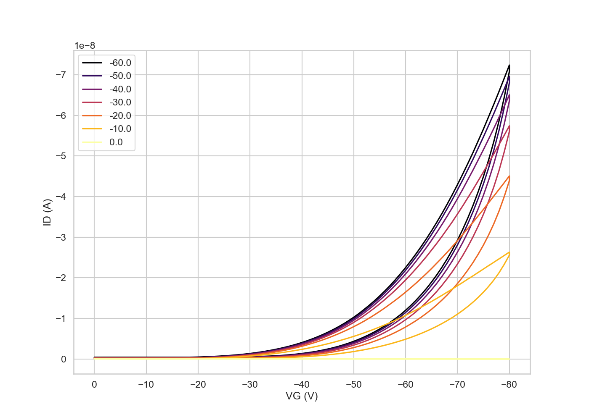

#### Master data frames

All these data frames have the same structure and can be loaded as follows:

```python
if data_name == 'Max_Hysteresis':
    df_temp = pd.read_csv('{}/Results/{}.csv'.format(data_folder, data_name), index_col=[0,1,2], header=[0,1]).sort_index(level=0)
else:
    df_temp = pd.read_csv('{}/Results/{}.csv'.format(data_folder, data_name), index_col=[0,1,2], header=[0,1,2]).sort_index(level=0)
```

As can be seen, the *Max_Hysteresis* file has a different header (because values of the FWD and REV scans are collapsed into one), but most of the files have the following structure:

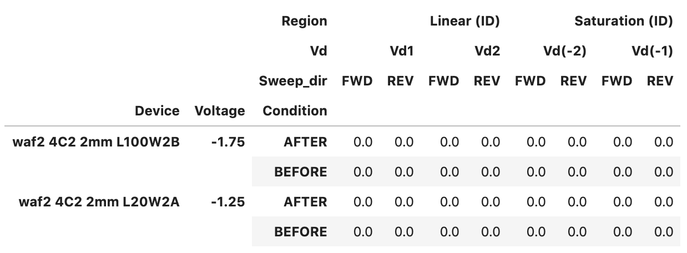

The following data frames are outputted.

- Slopes.csv
- Intercepts.csv
- Mobility.csv
- Reliability_factor.csv
- MU_eff.csv
- Min_ID.csv
- Max_ID.csv
- ID_at_VG_0.csv
- Ratio_ID.csv
- Max_Hysteresis.csv

All of the plots, if applicable, have a delta plot, which is calculated by subtracting the values before the condition to the values after the condition.

The analysis can be done over any type of condition, however, the plots are specific to the data-frames list above and the following conditions:

- Voltage
- Cycle
- Concentration
- Post-ACN

**Slopes and Intercepts**

To calculate the slopes, we need to identify the midpoint and isolate FWD and REV of the VGs.

```python
# VGs for slope
middle_point = int(len(main_VG) / 2)
fwd_VG = main_VG[middle_point-5:middle_point]
rev_VG = main_VG[middle_point:middle_point+5]
```

For most of the calculations we need the slope and the x-intercept, which are calculated:

```python
from scipy import stats

# ['Linear (ID)', 'Vd1', 'FWD']
slope, intercept, r_value, p_value, std_err = stats.linregress(fwd_VG, fwd_id1)

if linear:
    output_intercept = (-intercept / slope) - abs(vd / 2)
else:
    output_intercept = -intercept / slope
```

The *output_intercept* and the *slope* from this step are saved in their corresponding rows in a csv file.

The intercept is plotted as follows:

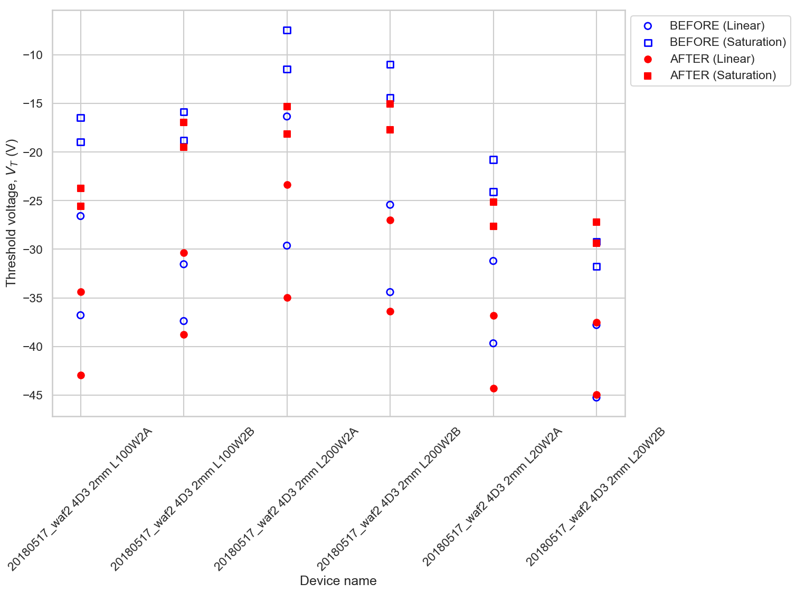

This example is the post-ACN condition, from the FWD TC scans.

Delta plot example:

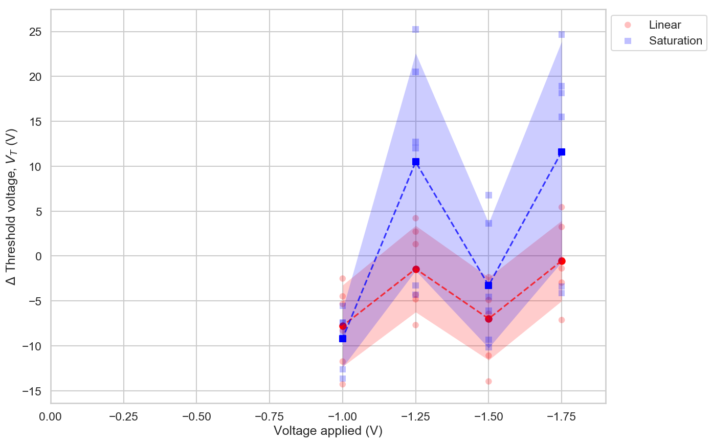

**Min_ID, Max_ID, ID_at_VG_0, and Ratio_ID (ON/OFF ratio)**

<!-- TODO: Min_ID, Max_ID, ID_at_VG_0, and Ratio_ID are... -->

This is calculated specifically for Linear and Saturation, as well as for FWD and REV.

```python
if column[0] == 'Linear (ID)':
    max_id = df_temp.iloc[first_iloc_max, second_iloc]
    if column[2] == 'FWD':
        id_at_0 = df_temp[:middle_point].loc[0, df_temp.columns[second_iloc]]
    else: # REV
        id_at_0 = df_temp[middle_point:].loc[0, df_temp.columns[second_iloc]]
    min_id = df_temp.iloc[first_iloc_min, second_iloc]
else: # Saturation
    max_id = math.pow(df_temp.iloc[first_iloc_max, second_iloc], 2) * (-1)
    if column[2] == 'FWD':
        id_at_0 = math.pow(df_temp[:middle_point].loc[0, df_temp.columns[second_iloc]], 2) * (-1)
    else: # REV
        id_at_0 = math.pow(df_temp[middle_point:].loc[0, df_temp.columns[second_iloc]], 2) * (-1)
    min_id = math.pow(df_temp.iloc[first_iloc_min, second_iloc], 2) * (-1)
ratio_id = abs(max_id/min_id)
```

Here are some example plots with their deltas:

Min ID:

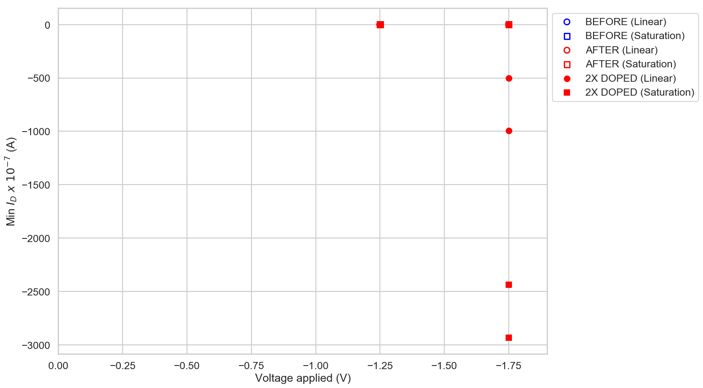


Max ID:

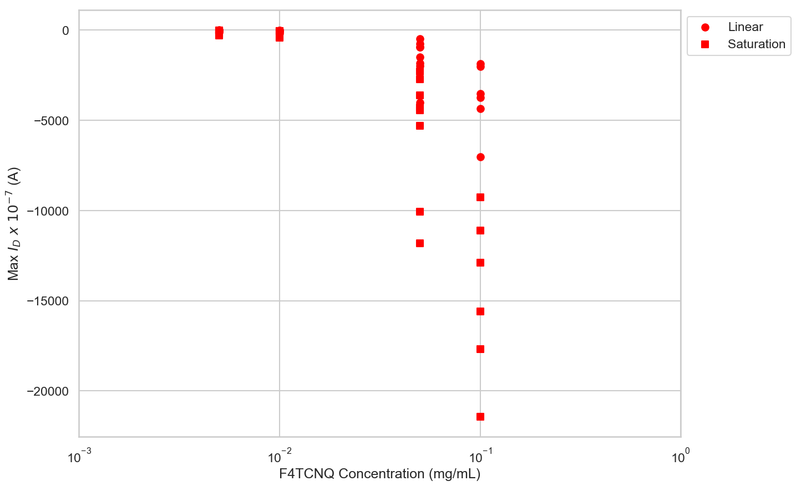
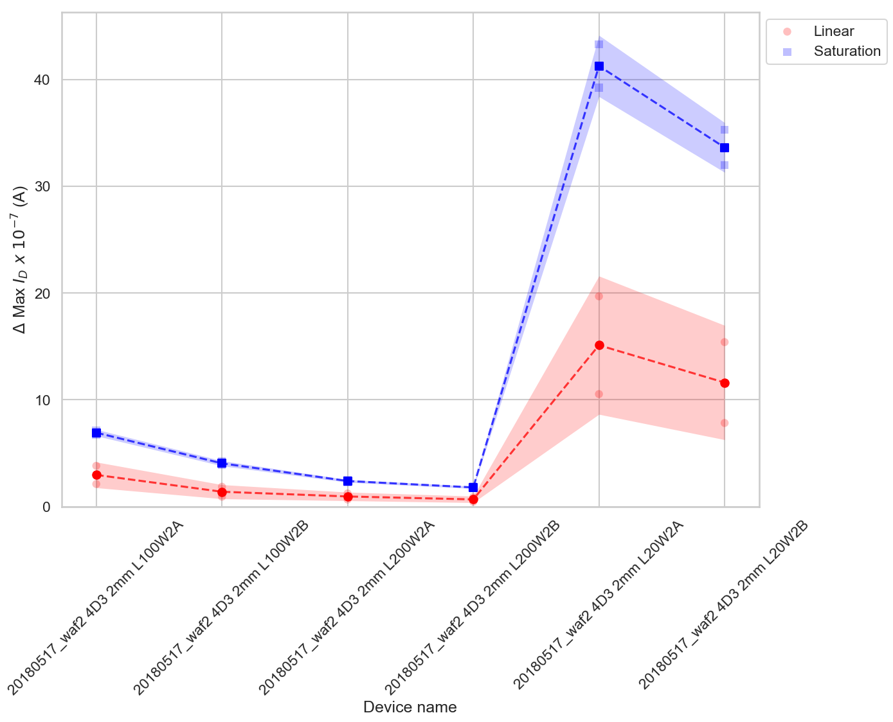

ID_at_VG_0:

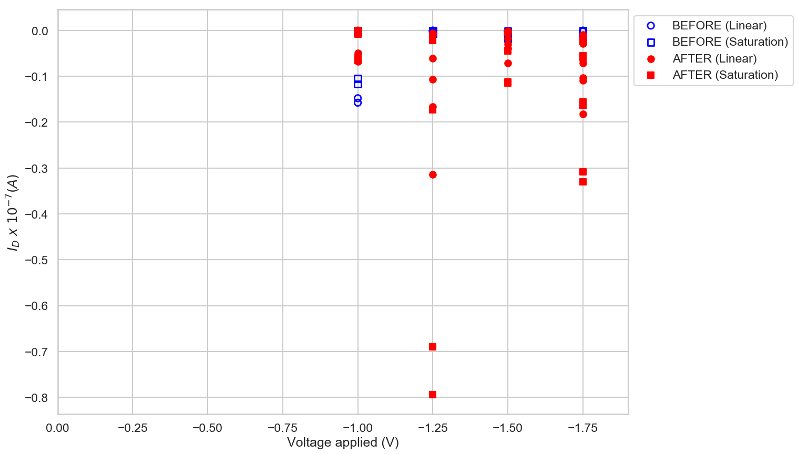
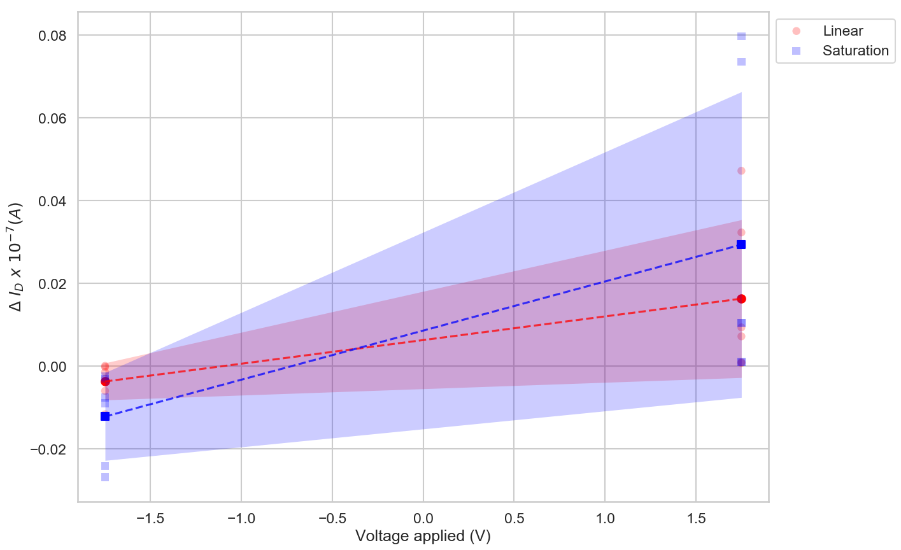

Ratio ID (ON/OFF ratio):

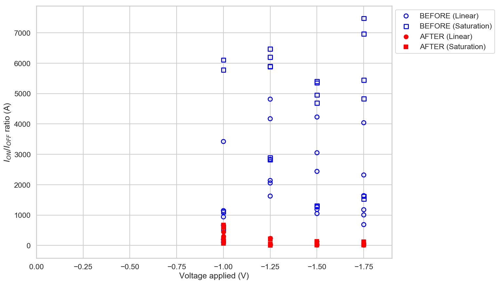
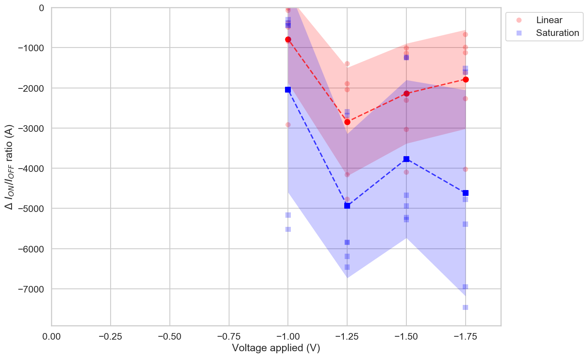

**Mobility**

<!-- TODO: mobility is... -->

To calculate mobility, we need to use the constant $$C_i = 1.72575 * 10^{-8}$$ (the capacitance of the insulating dielectric, in this case SiO2), and the channel Length and Width from the file name, as well as the slope from before.

```python
Ci = 1.72575*(10**(-8))
file_l = int(re.sub('\D', '', re.findall('L\d+W', filename)[0]))
file_w = int(re.sub('\D', '', re.findall('W\d+', filename)[0]))

lin_movility = ((file_l / (file_w * Ci * abs(vd_))) * slope) * 0.001
sat_mobility = (((2 * file_l) / (file_w * Ci)) * (slope ** 2)) * 0.001
```

Mobility in the linear and saturation regimes, respectively, is defined as:


An example mobility curve that is generated for a file is:

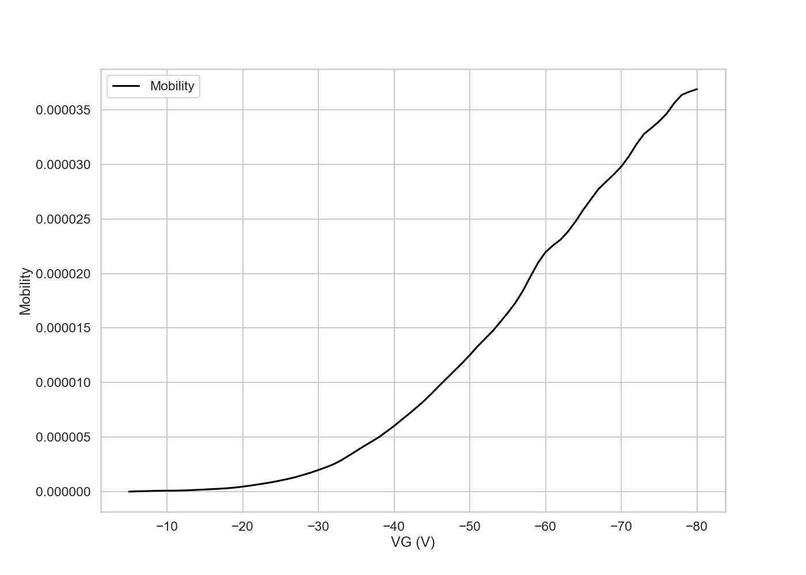

**Reliability_factor**

The reliability_factor is the measurement reliability factor, r, which captures to what degree the device performs like an ideal FET and obeys the Shockley equations, as presented in Choi, H. H.; Cho, K.; Frisbie, C. D.; Sirringhaus, H.; Podzorov, V. Critical Assessment of Charge Mobility Extraction in FETs. Nature Materials 2017, 17 (1), 2–7.  Mathematically, the reliability factor is the ratio of slope in ideal device with same claimed mobility (max ID at max VG) to the slope of the actual device.

For Reliability_factor, we use the same parameters, plus max_id, and id_at_0 from before.

```python
lin_reliability = ((abs(max_id) - abs(id_at_0))/abs(min(df_TC.index))) / slope
sat_reliability = math.pow(((np.sqrt(abs(max_id)) - np.sqrt(abs(id_at_0))) / abs(min(df_TC.index))), 2) / math.pow(slope, 2)
```

For these two values, a combined plot of mobility and reliability is created:

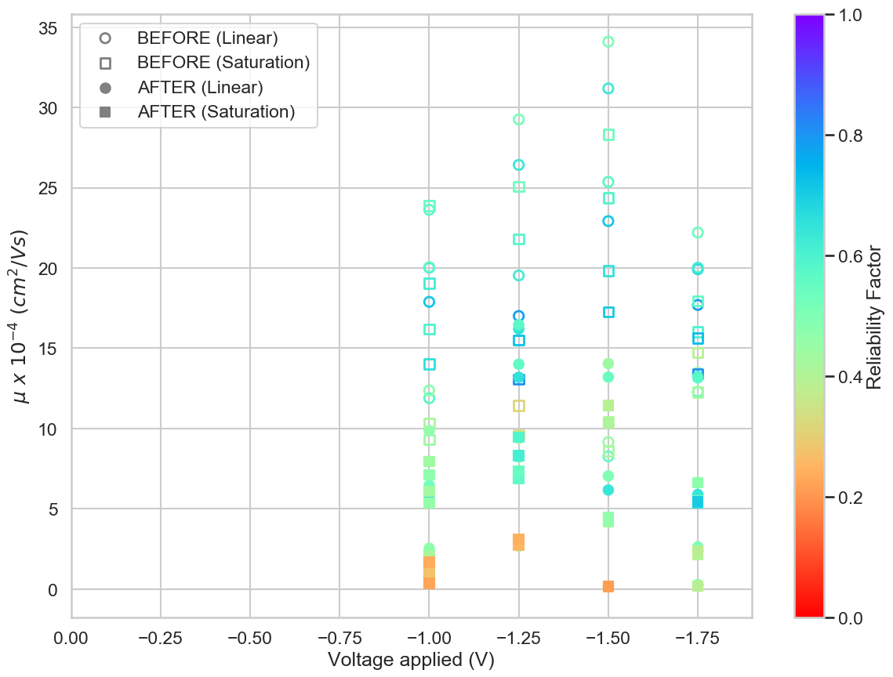

This example shows the  Voltage condition (values from FWD scans).

**MU_eff**

MU_eff is the effective mobility, representing the mobility an ideal FET would need to have to deliver the same electrical performance as the actual, non-ideal FET with un-modified (calculated as normal) mobility.  Thus, MU_eff is the product of the reliability factor and calculated mobility obtained earlier. 

Once these two values are calculated, MU_eff is calculated as follows:

```python
column = ['Linear (ID)', 'Vd1', 'FWD']
TC_mu_eff.loc[device_name, file_voltage, file_condition][column[0], column[1], column[2]] = reliability_temp * mobility_temp
```

An example plot is:

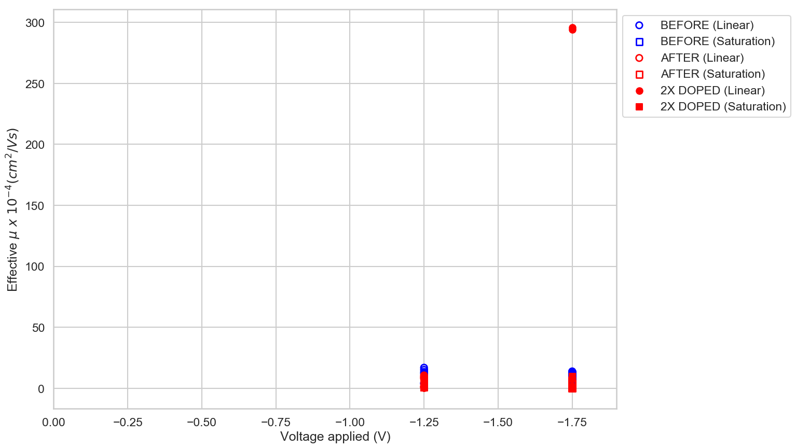

Delta:

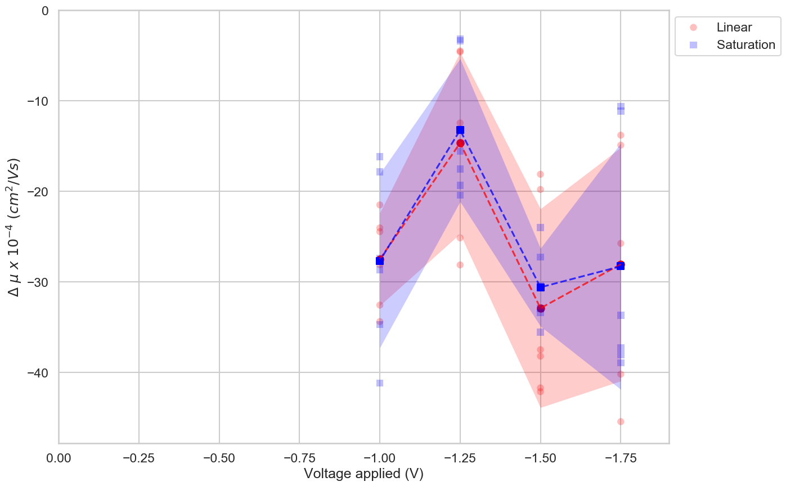

**Hysteresis**

Hysteresis describes the difference between the values of ID for the VG sweeps in the FWD and REV directions.   
Hysteresis of transfer curves = abs(Id_rev - Id_fwd)

For hysteresis, we take the max values for each of the 8 combinations per file, plus, a unique hysteresis csv per file, which we plot as follows:

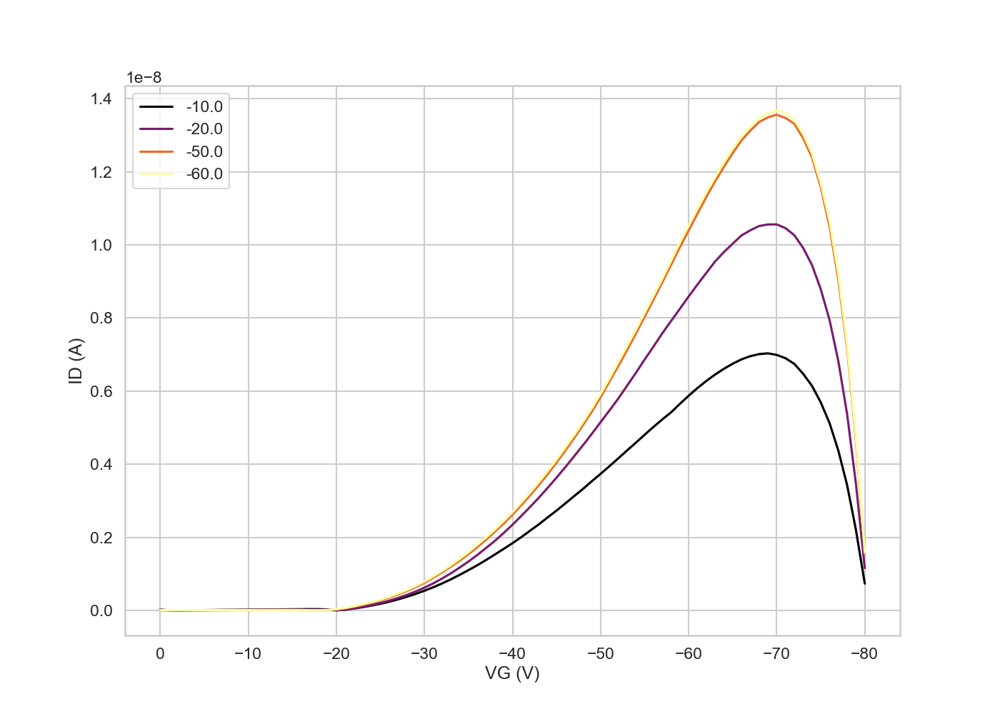

Delta:

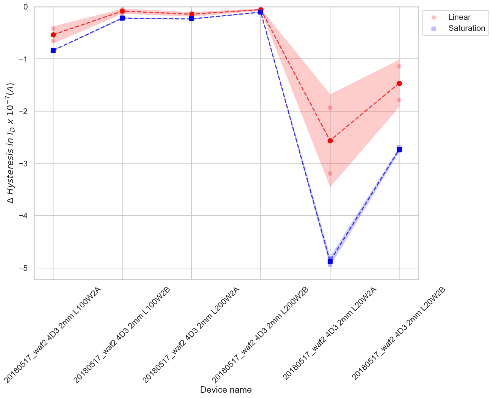

### OC Analysis

Output characteristic curves show drain current (ID) as a function of drain voltage (VD) with gate voltage (VG) held constant, typically done at several gate voltages. 

#### Char curves

Once an OC file is found, the script prepares the data as follows to be able to plot its *char_curve* with *ID (A)* or *IG (A)* as a function of *VD (V)*.

```python
df = pd.read_csv(os.path.join(args.data_folder, filename))

unique_VG = df.VG.unique()  # list unique values in VG

df0 = df.loc[df['VG'] == 0]  # pull out VD from first data set

# make two data frames with x = VD. Otherwise, they are empty
df_ID = pd.DataFrame(index=df0['VD'])
df_IG = pd.DataFrame(index=df0['VD'])

# Preparing Data

for n in unique_VG:
    ID = df.loc[df['VG'] == n]['ID']
    IG = df.loc[df['VG'] == n]['IG']
    df_ID[n] = list(ID)
    df_IG[n] = list(IG)
```

Example:

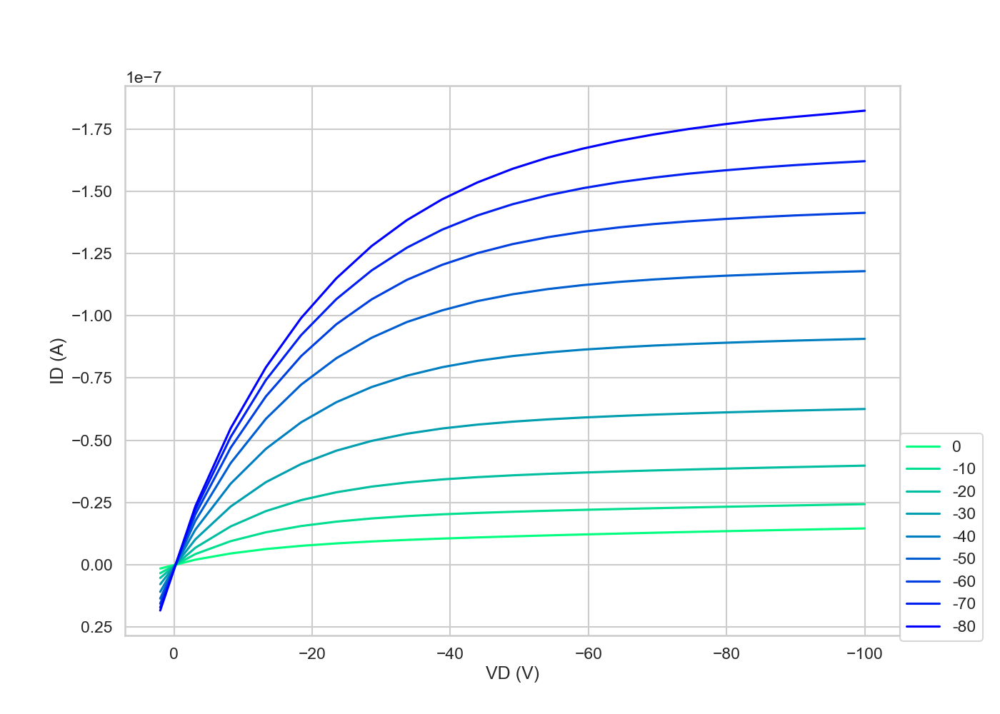

#### Master data frames

For the OC side, only 2 data frames are outputted:

- OC_master
- OC_master_RcontactFit

The latter is exported as follows:

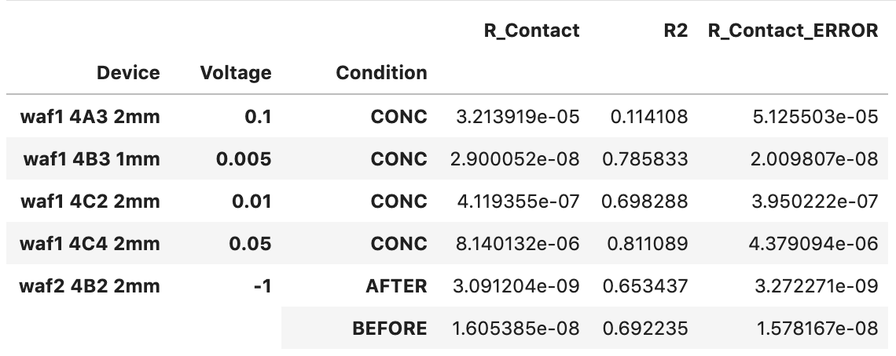

#### Plots

Besides the *ID (A)* vs *VD (V)* and *IG (A)* vs *VD (V)* curves mentioned above, the only additional plot generated for the OC analysis is the RcontactFit.  This is an example plot for a voltage condition before treatment:

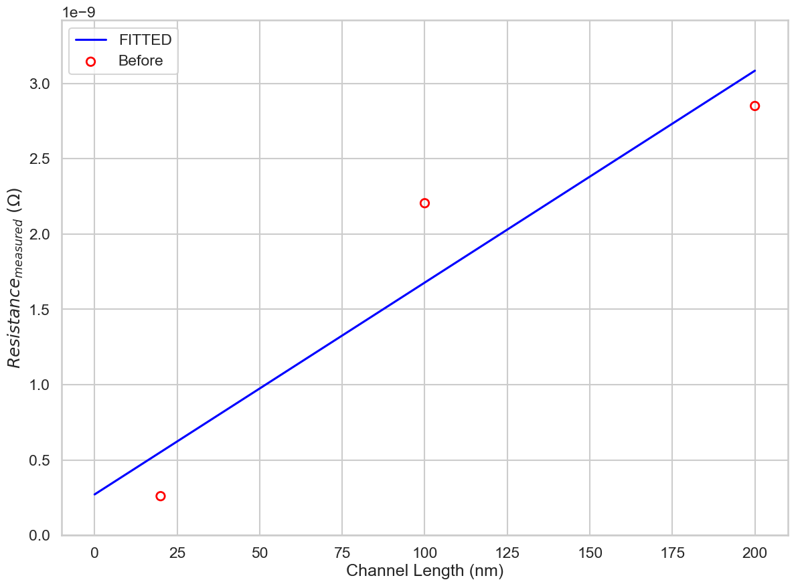
